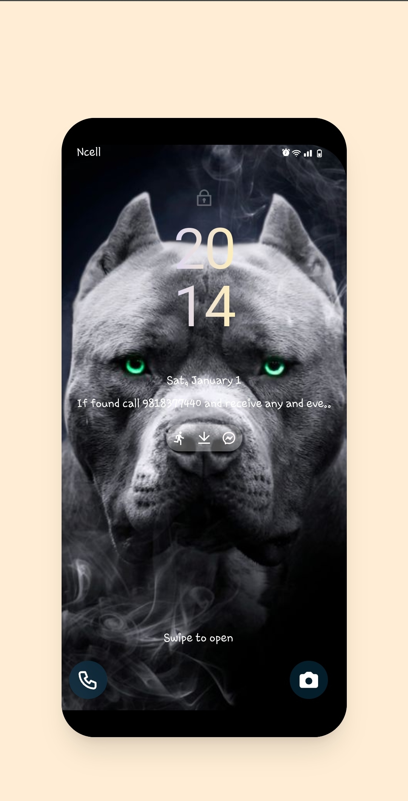

# PhoneDesign 📳

Made with ❤️ by [Sijan Mainali](https://t.me/sijan_mainali)

**Live preview: [https://sijan.educationhost.cloud/](https://sijan.educationhost.cloud/)**


---

## Project Description
Trying to Design phone completely using html and tailwind css.

## Tailwind Css

## Requirements

- Basic ReactJs knowledge

- Basic HTML, CSS knowledge


## Getting Started

you need to go the file directory and run

```shell

npm install

```

and after that start the dev server.

```shell

npm start

```
